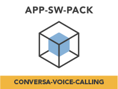
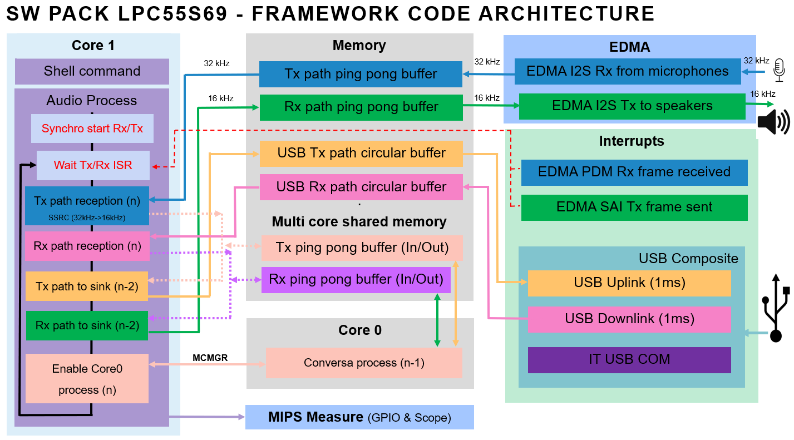

# NXP Application Code Hub
[](https://www.nxp.com)

## Conversa Voice Calling
This project holds the [Conversa Voice Calling App SW Pack](https://www.nxp.com/design/software/embedded-software/application-software-pack-conversa-voice-calling-on-i-mx-rt1170:APP-SW-PACK-CONVERSA-VOICE) running in the i.MX RT1170 and depends on the MCUXpresso SDK overall delivery.

The ```main_rt1170``` branch contains the conversa voice calling sw pack for the i.MX RT1170. To see other available devices, please check the other branches. 

<p align="center">
	
</p>

#### Boards: MIMXRT1170-EVK
#### Categories: Voice
#### Peripherals: SAI, DMA, USB
#### Toolchains: MCUXpresso IDE

## Table of Contents
1. [Resources](#step1)
2. [Software](#step1)
3. [Hardware](#step3)
4. [Setup](#step4)
5. [Results](#step5)
6. [FAQs](#step6) 
7. [Support](#step7)
8. [Release Notes](#step8)

## 1. Resources<a name="step1"></a>
* [Application Note AN13752](https://www.nxp.com/doc/AN13752) - Covers technical details of the software pack.s
* [Lab Guide](https://www.nxp.com/doc/AN13752) and [Video Walkthrough](https://www.nxp.com/pages/:TIP-APP-SW-PACK-CONVERSA-VOICE-CALLING) - Walks you through downloading, importing, and running the software pack.
* [Conversa Voice Suite User's Guide](https://www.nxp.com/webapp/Download?colCode=CVSUG) - Provides useful information about the Conversa Voice Suite library and covers technical information about the Conversa Tuning Tool.

## 2. Software<a name="step2"></a>
* [MCUXpresso IDE v11.6.0](https://www.nxp.com/design/software/development-software/mcuxpresso-software-and-tools-/mcuxpresso-integrated-development-environment-ide:MCUXpresso-IDE).
* [Conversa Tuning Tool](https://www.nxp.com/design/software/embedded-software/application-software-pack-conversa-voice-calling-on-i-mx-rt1170:APP-SW-PACK-CONVERSA-VOICE) for the i.MX RT1170.

## 3. Hardware<a name="step3"></a>
* [MIMXRT1170-EVK](https://www.nxp.com/design/development-boards/i-mx-evaluation-and-development-boards/i-mx-rt595-evaluation-kit:MIMXRT1170-EVK)
* Two micro USB cables.
* Conversa Hardware mockup for a complete test.

## 4. Setup<a name="step4"></a>

### 4.1 Assemble the Application
You need to have both Git and [West](https://docs.zephyrproject.org/latest/develop/west/index.html) installed, then execute below commands to gather the whole APP-SW-PACKS/CONVERSA-VOICE-CALLING delivery at branch ```${branch}``` and place it in a folder named ```appswpacks_conversa_voice_calling```. 

Replace ```${branch}``` with another branch within the repo to select the device you would like to use. This can be ```main_rt1170``` for the MIMXRT1170-EVK. To see other available devices, please check the other branches. 

```
west init -m https://github.com/nxp-appcodehub/ap-conversa-voice-calling --mr ${branch} appswpacks_conversa_voice_calling
cd appswpacks_conversa_voice_calling
west update
```

You can find more information about setup the application software pack in the Audio Lab Guides included in the [AN13752](https://www.nxp.com/doc/AN13752). 

### 4.2 Build and Run the Application
To build and run the application please refer to the chapter 5. Audio Lab Guides within the [AN13752](https://www.nxp.com/doc/AN13752).

## 5. Results<a name="step5"></a>

### Application Overview
This software application pack enables a complete voice call application using NXP’s i.MX RT1170 crossover MCU and Conversa Voice Suite.

After initializing the necessary hardware, the demo launches a Shell task:

1. **Shell Task:** Waits for user input to select one of the software configurations. Type ```help``` to see all the available options:

    With Conversa Voice Suite processing

        voicecall spswp16k    => Speaker phone with Conversa software (required voice call RT1170 mockup). Teams conferencing device 2.3m. Fs=16kHz
        voicecall spswp32k    => Speaker phone with Conversa software (required voice call RT1170 mockup). Teams conferencing device 2.3m. Fs=32kHz.

    Without Conversa Voice Suite processing

        voicecall usbswp16k    => USB microphones and USB speaker. Fs=16kHz
        voicecall usbswp32k    => USB microphones and USB speaker. Fs=32kHz

        WARNING : FOR lb CONFIGURATION REMOVE SPEAKER JACK CONNECTOR AND PLUG A HEADSET TO AVOID LARSERN EFFECT AND DAMAGE SPEAKER: WARNING
        WARNING : FOR lb CONFIGURATION REMOVE SPEAKER JACK CONNECTOR AND PLUG A HEADSET TO AVOID LARSERN EFFECT AND DAMAGE SPEAKER: WARNING

        voicecall lbswp16k    => Loop back between microphones and headset + USB microphones. Fs=16kHz
        voicecall lbswp32k    => Loop back between microphones and headset + USB microphones. Fs=16kHz


    **RT1170 mockup** : RT1170 EVKA (3 microphones used) + TA2024 amplifier + 1 TangBand 2136 speaker

    **sp** : sp means speaker phone with Conversa software. Conversa Tx output is sent to Tx USB channel 0. Conversa Rx output is sent to the speaker.

    **usb** : USB only use case, no process is running. Tx chain input (microphones) datas are sent USB Tx. USB Rx datas are sent to speakers. No process is present.
    
    **lb**  : lb means loop back. Tx chain input are sent to speakers and to USB Tx. USB Rx datas are not handled. No process is present.
    
    WARNING : FOR lb CONFIGURATION REMOVE SPEAKER JACK CONNECTOR AND PLUG A HEADSET TO AVOID HOWLING AND POTENTIAL SPEAKER DAMAGE: WARNING

    Once you select an option, the demo launches an AUDIO_TxRxTask.


2. **AUDIO_TxRxTask:** The AUDIO Task configures the audio paths and handles the input and output audio buffers to enable the voice calling application.

If a conversa voice calling software configuration is selected, the AUDIO task will execute the Conversa echo-cancelling audio processing.

**NOTE:** The Conversa library comes with a 10-minute trial timeout.

The image below shows the audio framework architecture.  \



## 6. FAQs<a name="step6"></a>

### 6.1 How to get the Conversa HW mockup?
Contact us at voice@nxp.com

### 6.1 How to get an extended timeout Conversa library?
Contact us at voice@nxp.com

### 6.3 Have a question about the Conversa Voice Calling Software Pack?
If you have some question, you can contact FAE or create a ticket to NXP community.

### 6.4 Other Reference Applications
For other rapid-development software bundles please visit the [Application Software Packs](https://www.nxp.com/design/software/embedded-software/application-software-packs:APPSWPACK) page.

To find another NXP application software packs or demos, visit NXP's [Application Code Hub](https://mcuxpresso.nxp.com/appcodehub).

For SDK examples please go to the [MCUXpresso SDK](https://github.com/nxp-mcuxpresso/mcux-sdk) and get the full delivery to be able to build and run examples that are based on other SDK components.

## 7. Support<a name="step7"></a>
#### Project Metadata
<!----- Boards ----->
[](https://github.com/search?q=org%3Anxp-appcodehub+MIMXRT1170-EVK+in%3Areadme&type=Repositories)

<!----- Categories ----->
[](https://github.com/search?q=org%3Anxp-appcodehub+voice+in%3Areadme&type=Repositories)

<!----- Peripherals ----->
[](https://github.com/search?q=org%3Anxp-appcodehub+i2s+in%3Areadme&type=Repositories) [](https://github.com/search?q=org%3Anxp-appcodehub+dma+in%3Areadme&type=Repositories) [](https://github.com/search?q=org%3Anxp-appcodehub+usb+in%3Areadme&type=Repositories)

<!----- Toolchains ----->
[](https://github.com/search?q=org%3Anxp-appcodehub+mcux+in%3Areadme&type=Repositories)

Questions regarding the content/correctness of this example can be entered as Issues within this GitHub repository.

>**Warning**: For more general technical questions regarding NXP Microcontrollers and the difference in expected funcionality, enter your questions on the [NXP Community Forum](https://community.nxp.com/)

[](https://www.youtube.com/@NXP_Semiconductors)
[](https://www.linkedin.com/company/nxp-semiconductors)
[](https://www.facebook.com/nxpsemi/)
[](https://twitter.com/NXP)


## 8. Release Notes<a name="step8"></a>
| Version | Description / Update                           | Date                        |
|:-------:|------------------------------------------------|----------------------------:|
| 1.0     | Initial release on Application Code HUb        | April 5<sup>th</sup> 2023   |